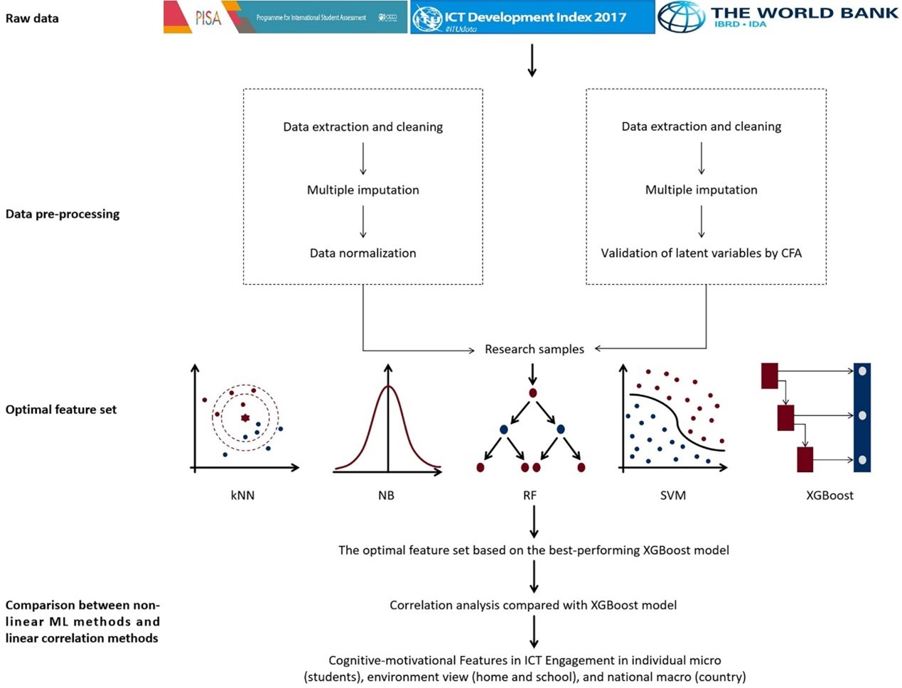

# Cognitive-motivational Features in ICT Engagement with Artificial Intelligence Algorithms
This study analyzed features influencing student cognitive-motivational engagement in information and communication technology (ICT) using large-scale assessment data from the Programme for International Student Assessment (PISA) 2018, which included 247,842 students from the Organisation for Economic Co-operation and Development (OECD) countries.

# Running Commond
1. Extract the x_data_scale_final.rar file in the data path;
2. Run the CV-data.py to generate datasets for five-fold validation;
3. Run XGB.py to train the XGBoost model and evaluate its performance, and analyze feature importances.
